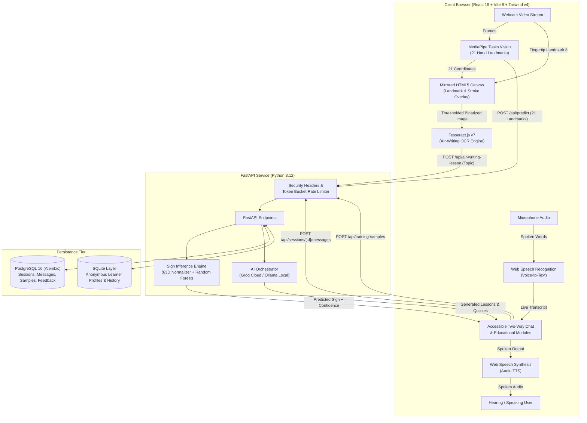
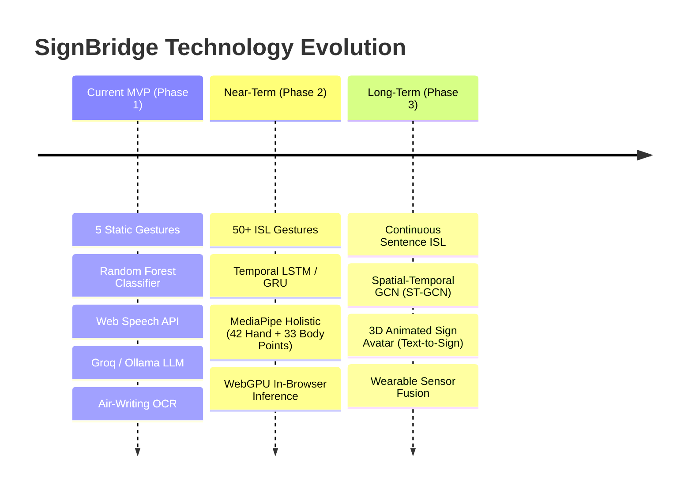

# SignBridge
https://signbridge-z02n.onrender.com/

[](https://www.python.org/)
[](https://fastapi.tiangolo.com/)
[](https://react.dev/)
[](https://vitejs.dev/)
[](https://tailwindcss.com/)
[](https://www.postgresql.org/)
[](https://developers.google.com/mediapipe)
[](tests/)

**SignBridge** is an assistive technology ecosystem developed at **VIT Bhopal University (SCOPE)**. It combines computer vision, browser-level speech synthesis and recognition, generative artificial intelligence, and optical character recognition to bridge the communication gap between individuals with hearing or speech impairments and non-signers.

SignBridge serves as both a **real-time bidirectional communication bridge** and an **adaptive multi-modal educational portal** with cutting-edge mid-air fingertip writing.

---

## Table of Contents

- [Architectural Overview](#architectural-overview)
- [New Innovations & Recent Milestones](#new-innovations--recent-milestones)
- [Comprehensive Feature Breakdown](#comprehensive-feature-breakdown)
  - [1. Real-Time Two-Way Communication Bridge](#1-real-time-two-way-communication-bridge)
  - [2. Mid-Air Writing & Optical Finger Tracking](#2-mid-air-writing--optical-finger-tracking)
  - [3. Direct-Entry Accessible Learning Pathways](#3-direct-entry-accessible-learning-pathways)
  - [4. Dual-Engine Generative AI & Knowledge Checks](#4-dual-engine-generative-ai--knowledge-checks)
  - [5. In-App Data Collection & ML Training Pipeline](#5-in-app-data-collection--ml-training-pipeline)
  - [6. Privacy Architecture & Enterprise Hardening](#6-privacy-architecture--enterprise-hardening)
- [Machine Learning & Feature Engineering](#machine-learning--feature-engineering)
- [Future Technology & Research Horizons](#future-technology--research-horizons)
- [API Reference](#api-reference)
- [Quick Start & Installation](#quick-start--installation)
  - [Option A: Docker Compose (Recommended)](#option-a-docker-compose-recommended)
  - [Option B: Local Environment Setup](#option-b-local-environment-setup)
- [Machine Learning Workflow](#machine-learning-workflow)
- [Testing & Quality Assurance](#testing--quality-assurance)
- [Configuration Reference](#configuration-reference)
- [Ethics, Privacy, & MVP Disclaimer](#ethics-privacy--mvp-disclaimer)

---

## Architectural Overview

SignBridge features a privacy-centric decoupled architecture where heavy video processing runs client-side inside the browser using WebAssembly and WebGL, while lightweight landmark payloads are processed by a hardened FastAPI backend.



---

## New Innovations & Recent Milestones

The SignBridge platform has recently undergone significant architectural modernization, introducing high-performance libraries, new interaction paradigms, and enterprise security:

1. **Modernized Frontend Stack (React 19, Vite 8, Tailwind CSS v4):**
   - Upgraded to the React 19 concurrent renderer and Vite 8 build pipeline.
   - Integrated the latest `@tailwindcss/vite` engine for zero-runtime utility styling.
   - Adopted **Oxlint** for ultra-fast JavaScript and JSX linting, completing scans in milliseconds.

2. **Mid-Air Writing & Optical Finger Tracking (`AirWriter.jsx`):**
   - Introduced an interactive air-writing canvas allowing users to draw letters and words in the air using only their index fingertip.
   - Built an in-browser image preprocessing pipeline (bounding-box cropping, pixel thresholding, binarization, and 3x upscaling).
   - Integrated **Tesseract.js v7** for on-device OCR, converting airborne finger paths into recognized text and triggering instant AI lessons.

3. **Dual-Engine Generative AI Architecture:**
   - Seamless switching between ultra-fast cloud LLM inference (**Groq** with `llama-3.1-8b-instant`) and offline, private on-device models (**Ollama** with `qwen2.5:3b`).
   - Unified error handling and response sanitization (`AIServiceError`) preventing backend leakages during provider disruptions.

4. **Hybrid Dual-Tier Persistence Engine:**
   - **PostgreSQL 16 with Alembic Migrations:** Stores real-time conversation messages, time-stamped chat sessions, in-app labeled training samples, and system feedback.
   - **SQLite Compatibility Layer:** Maintains backward compatibility for anonymous learner profiles, learning streaks, and quiz results without requiring credentials.

5. **Token-Bucket Rate Limiting & Enterprise Security:**
   - Implemented an in-memory `TokenBucket` rate limiter protecting computational and AI routes (`/api/generate`, `/api/quiz`, `/api/air-writing-lesson`, `/api/sign/lesson`).
   - Added a `SecurityHeadersMiddleware` enforcing strict HTTP response security headers (HSTS, Content Security Policy, X-Content-Type-Options, Referrer-Policy).
   - Added trusted proxy subnet resolution (`TRUSTED_PROXY_IPS`) for secure IP extraction behind cloud load balancers.

6. **Privacy-by-Design Anonymous Architecture (`X-Learner-Id`):**
   - Completely eliminated registration forms and passwords.
   - Uses cryptographically generated UUIDv4 tokens (`X-Learner-Id`) stored in `localStorage` or session memory.
   - Implemented a complete GDPR-style erasure route (`DELETE /api/me`) that purges all associated sessions, chat messages, and learning records in one atomic transaction.

7. **Extensive Automated Test Harness:**
   - 42 comprehensive backend test cases covering AI fault tolerance, communication APIs, rate limiters, security headers, learner data integrity, and sign classification.
   - Node-based test runners for speech text cleaning and sentence splitting, alongside Axe-core accessibility auditing.

---

## Comprehensive Feature Breakdown

### 1. Real-Time Two-Way Communication Bridge
- **Sign → Text → Speech:**
  - Extracts 21 3D landmarks from live webcam frames at 30–60 FPS using MediaPipe Tasks Vision (`@mediapipe/tasks-vision`).
  - Converts coordinates into a 63-dimensional normalized feature vector.
  - Classifies static demo gestures using a Scikit-Learn Random Forest model.
  - Implements a **temporal stabilization filter**: commits a predicted sign to the conversation only after **5 consecutive frames** exceed a **70% confidence threshold** (both configurable via environment variables).
  - Automatically speaks out the recognized sign via the browser's `SpeechSynthesis` engine with precise latency recording (`speech_start_latency_ms`).
- **Voice → Readable Text:**
  - Utilizes the Web Speech Recognition API to transcribe spoken responses from hearing communication partners.
  - Displays large, high-contrast, easily readable text designed for deaf or hard-of-hearing users.
  - Supports configurable spoken language/dialects (e.g., `en-US`, `en-IN`).
  - Offers an instantaneous typed-message fallback when a microphone is unavailable or permissions are denied.
- **Latency & Performance Metrics:**
  - Measures total latency from first high-confidence candidate detection to text commit (`latency_ms`) and audio start (`speech_start_latency_ms`).
  - Summarizes observed round-trip latencies via `/api/evaluation/summary`.

### 2. Mid-Air Writing & Optical Finger Tracking
- **Hand Landmark Tracking:** Isolates Landmark 8 (Index Fingertip) using MediaPipe Hands.
- **Mirrored Drawing Canvas:** Renders a fluid neon-cyan stroke trail directly over the mirrored webcam stream.
- **Stroke Preservation:** Retains active strokes if the hand momentarily drops out of frame.
- **Idle Pause Detection:** Automatically detects a 1.2-second pause in writing to finalize the stroke sequence.
- **Canvas Image Preprocessing:** Crops the bounding box of the drawn stroke with safety padding, maps alpha pixels to high-contrast monochrome values, and applies 300% bilinear scaling for clean OCR input.
- **Client-Side OCR (Tesseract.js):** Runs an in-browser Tesseract worker to recognize Latin characters and English words without uploading video frames to any external server.
- **Editable Topic Review:** Allows the user to inspect and edit the recognized word before dispatching it to the lesson generation engine.

### 3. Direct-Entry Accessible Learning Pathways
SignBridge provides three tailored educational tracks with zero authentication friction:
- **Blind Mode:**
  - Prompts LLMs to format lessons in flowing, descriptive natural language optimized for screen readers (NVDA, JAWS, VoiceOver), eliminating complex visual tables and markup clutter.
  - Interactive browser TTS with playback controls (start, pause, resume, cancel).
  - Text cleanup engine (`speech.js`) that strips Markdown asterisks, headers, and hashes while preserving hyphenated words.
  - Sentence-chunking algorithm (capped at 220 characters) preventing browser audio buffer crashes.
- **Deaf Mode:**
  - Generates content with high-contrast typography, clear Markdown hierarchies, visual bullet points, and simplified definitions.
  - Persistent visual feedback for all interactive quiz steps.
- **Sign / Non-Speaking Mode:**
  - Maps physical hand gestures directly to curated educational topics (e.g., `HELLO` $\rightarrow$ Greetings & Communication, `STOP` $\rightarrow$ Boundaries & Safety, `HELP` $\rightarrow$ Community & Emergency Support).
  - Offers camera start/stop controls, live confidence bars, and fallback manual topic entry.

### 4. Dual-Engine Generative AI & Knowledge Checks
- **Dynamic Routing:** Automatically routes to Groq Cloud API when `GROQ_API_KEY` is present; falls back seamlessly to local Ollama endpoints (`http://127.0.0.1:11434`) when running offline.
- **Adaptive Lesson Generator (`/api/generate`):** Crafts concise, persona-specific educational lessons (max 550 tokens) adapted to the selected learning pathway.
- **Interactive Quiz Generator (`/api/quiz`):** Generates 3-question multiple-choice quizzes based on the current lesson topic, complete with four options (A, B, C, D) and a Markdown answer key with explanations.
- **Streak & Score Tracking:** Tracks quiz completion, score tallies, and active learning streaks per anonymous learner ID.

### 5. In-App Data Collection & ML Training Pipeline
- **Web-Based Dataset Collector:** Users can hold a handshape in view and click "Save current hand sample" to record raw 21-point landmarks directly to PostgreSQL via `/api/training-samples`.
- **CLI Capture Utility (`ml.collect_data`):** Terminal-driven OpenCV + MediaPipe collection tool for capturing hundreds of gesture samples with spacebar triggers.
- **Sample Exporter (`ml.export_samples`):** Exports stored database samples into CSV format (`data/raw/landmarks.csv`).
- **Stratified Baseline Trainer (`ml.train`):** Trains a multi-class Scikit-Learn `RandomForestClassifier` using stratified 80/20 train/test splits, generating confusion matrices and classification reports.

### 6. Privacy Architecture & Enterprise Hardening
- **Client-Side Inference:** Webcam video streams never leave the user's browser. Only extracted 21-point $(x, y, z)$ coordinates are transmitted over HTTP.
- **Zero Registration Gate:** Anonymous UUIDs prevent collection of personally identifiable information (PII).
- **GDPR-Style Erasure (`DELETE /api/me`):** Completely deletes conversation sessions, messages, and learner history associated with the requesting UUID.
- **Security Middleware:** Enforces rate limits per IP/client token and injects security headers to defend against clickjacking, MIME-sniffing, and cross-site scripting.

---

## Machine Learning & Feature Engineering

### Landmark Normalization Pipeline
Raw MediaPipe hand landmarks vary dramatically depending on the user's distance from the camera, hand size, and positioning. SignBridge implements geometric invariant normalization in [`ml/features.py`](file:///c:/Users/anand/OneDrive/Apps/SIGNBRIDGE/ml/features.py):

$$\mathbf{P}_i = (x_i, y_i, z_i), \quad i \in [0, 20]$$

1. **Wrist-Relative Translation:** The wrist landmark ($\mathbf{P}_0$) is shifted to the coordinate origin:
   $$\mathbf{P}'_i = \mathbf{P}_i - \mathbf{P}_0$$
2. **Scale Invariance:** The maximum Euclidean distance from the wrist to any other hand landmark is computed:
   $$S = \max_{i \in [1, 20]} \|\mathbf{P}'_i\|_2$$
   All relative coordinates are normalized by this scale factor:
   $$\mathbf{P}''_i = \frac{\mathbf{P}'_i}{S}$$
3. **Left-Hand Canonical Mirroring:** If the hand is identified as left-handed, horizontal $x$-coordinates are reflected ($x \leftarrow -x$) so a single model classifies both hands without requiring double the training data:
   $$\hat{x}_i = -x''_i \quad (\text{if left hand}), \qquad \hat{x}_i = x''_i \quad (\text{if right hand})$$
4. **Vector Flattening:** Produces a 63-element feature vector:
   $$\mathbf{F} = [\hat{x}_0, \hat{y}_0, \hat{z}_0, \dots, \hat{x}_{20}, \hat{y}_{20}, \hat{z}_{20}]$$

### Supported Baseline Vocabulary
| Gesture Label | Visual Cue & Handshape Description |
| :--- | :--- |
| **HELLO** | Open palm, fingers spread and raised upright |
| **STOP** | Open palm facing forward, fingers held together |
| **YES** | Closed fist, thumb raised pointing upward |
| **NO** | Index finger extended upright alone; other fingers folded |
| **HELP** | Closed fist, thumb tucked across folded fingers |

---

## Future Technology & Research Horizons

While SignBridge currently functions as an interactive browser-based MVP, the system has been architected with future upgrades in mind:



### 1. Continuous Sign Language Recognition via ST-GCN & Pose Transformers
- **Current Limitation:** Static single-frame classification cannot recognize continuous Indian Sign Language (ISL), which relies on temporal movement trajectories.
- **Future Technology:** Upgrading the ML engine to **Spatial-Temporal Graph Convolutional Networks (ST-GCN)** and **Pose Transformers**. These models treat the skeleton joints as nodes in a graph over time, capturing velocity, acceleration, and hand shape trajectories to decipher full grammatical sentences.

### 2. Full MediaPipe Holistic Integration (Multi-Modal Non-Manual Signals)
- **Current Limitation:** Only tracks 21 points on a single hand.
- **Future Technology:** Upgrading to **MediaPipe Holistic**, extracting:
  - **Both Hands (42 landmarks):** Enabling two-handed signs that make up the majority of ISL.
  - **Upper-Body Pose (33 landmarks):** Capturing shoulder orientation, arm positioning, and torso movements.
  - **Facial Mesh (468 landmarks):** Sign language grammar relies heavily on **non-manual markers** (eyebrow raises, mouth morphemes, head tilts) that distinguish questions from statements.

### 3. Edge AI with WebGPU & ONNX Runtime (Zero-Latency Local Inference)
- **Current Limitation:** The browser extracts landmarks and transmits them to FastAPI over HTTP, introducing 15–40 ms network round-trip delays.
- **Future Technology:** Exporting trained PyTorch/TensorFlow models to **ONNX Web / WebGPU**. This allows deep temporal neural networks to execute directly on the user's graphics card inside the browser, eliminating network hops and ensuring 100% offline functionality.

### 4. Bidirectional 3D Animated Sign Avatar (Voice/Text → ISL Translation)
- **Current Limitation:** The return path from voice/text to sign is limited to text display.
- **Future Technology:** Embedding a 3D WebGL / Three.js character avatar that converts incoming spoken audio and text messages into fluent 3D sign animations (synthesizing bone rotations from an ISL motion-capture dictionary).

### 5. Multi-Modal Wearable & Sensor Fusion
- **Current Limitation:** Camera occlusions (e.g., hand hidden behind clothing or turned sideways) cause landmark tracking failure.
- **Future Technology:** Pairing computer vision with smart IoT gloves equipped with Inertial Measurement Units (IMUs) and flex sensors to maintain reliable tracking even under severe optical occlusion and dark lighting.

---

## API Reference

The FastAPI service exposes the following endpoints:

| Method | Endpoint | Description | Auth / Headers |
| :--- | :--- | :--- | :--- |
| `GET` | `/api/health` | Service health status, database readiness, model status | None |
| `GET` | `/api/vocabulary` | Returns 5 supported gestures and training sample counts | None |
| `POST` | `/api/predict` | Classifies 21 landmarks or base64 image; returns sign, confidence, latency | None |
| `POST` | `/api/sessions` | Creates a new conversation session | `X-Learner-Id` |
| `GET` | `/api/sessions/{id}/messages` | Retrieves message history for the active session | `X-Learner-Id` |
| `POST` | `/api/sessions/{id}/messages` | Appends a sign or voice message to the conversation | `X-Learner-Id` |
| `PATCH` | `/api/sessions/{id}/messages/{msg_id}/speech-start` | Records browser speech-start latency metric | `X-Learner-Id` |
| `DELETE` | `/api/sessions/{id}` | Deletes a conversation session | `X-Learner-Id` |
| `POST` | `/api/profile` | Creates/updates anonymous profile (blind, deaf, sign, non_speaking) | `X-Learner-Id` |
| `POST` | `/api/generate` | Generates accessible AI lesson tailored to learner mode | `X-Learner-Id` (Rate Limited) |
| `POST` | `/api/quiz` | Generates 3-question MCQ quiz for a topic | `X-Learner-Id` (Rate Limited) |
| `POST` | `/api/quiz-result` | Records quiz score and updates streaks | `X-Learner-Id` |
| `POST` | `/api/sign/lesson` | Classifies hand landmarks and generates gesture lesson | `X-Learner-Id` (Rate Limited) |
| `POST` | `/api/air-writing-lesson` | Receives OCR-recognized topic and returns AI lesson | `X-Learner-Id` (Rate Limited) |
| `GET` | `/api/history` | Fetches learner lesson history and generated topics | `X-Learner-Id` |
| `GET` | `/api/stats` | Fetches learner score, quizzes completed, and streak | `X-Learner-Id` |
| `DELETE` | `/api/me` | Purges all sessions, messages, and profile data | `X-Learner-Id` |
| `POST` | `/api/training-samples` | Submits 21-point landmark sample for model training | Database Session |
| `POST` | `/api/evaluation/feedback` | Submits 1–5 user experience feedback ratings | Database Session |
| `GET` | `/api/evaluation/summary` | Summarizes timing metrics and user ratings | None |

---

## Quick Start & Installation

### Option A: Docker Compose (Recommended)

Docker Compose starts PostgreSQL 16, the FastAPI backend, and the Vite client with healthchecks configured.

```bash
# 1. Clone and enter the repository
git clone https://github.com/ashishpal-018/signbridge.git
cd signbridge

# 2. Copy the environment configuration
cp .env.example .env

# 3. Spin up all containers
docker compose up --build
```

- Web Interface: [http://localhost:5173](http://localhost:5173)
- FastAPI Health Check: [http://localhost:8000/api/health](http://localhost:8000/api/health)

To stop the services and retain database volumes:
```bash
docker compose down
```

---

### Option B: Local Environment Setup

**Prerequisites:** Python 3.12+, Node.js 22+, npm, and PostgreSQL 16+ (or SQLite fallback).

#### 1. Backend Setup

```powershell
# Create and activate Python virtual environment
py -3.12 -m venv .venv
.\.venv\Scripts\Activate.ps1

# Upgrade pip and install dependencies
python -m pip install --upgrade pip
python -m pip install -r requirements.txt -r requirements-dev.txt

# Initialize configuration
Copy-Item .env.example .env

# Run database migrations
alembic upgrade head

# Start FastAPI server
python run.py
```
The backend will start at `http://127.0.0.1:8000`.

#### 2. Frontend Setup

In a second terminal window:

```powershell
cd client
npm ci
npm run dev
```
The Vite development server will start at `http://127.0.0.1:5173` with automatic proxying of `/api` requests to port `8000`.

---

## Machine Learning Workflow

If you wish to train or update the gesture classification model:

### 1. Collect Gesture Samples
Collect at least 200 samples per hand gesture:

```powershell
python -m ml.collect_data --label HELLO --samples 200
python -m ml.collect_data --label STOP --samples 200
python -m ml.collect_data --label YES --samples 200
python -m ml.collect_data --label NO --samples 200
python -m ml.collect_data --label HELP --samples 200
```
*Controls:* Press `Space` to capture a frame; press `Q` to quit.

Alternatively, save samples directly inside the web application via the **"Collect a labeled training sample"** panel.

### 2. Export & Train
```powershell
# Export samples from PostgreSQL into CSV format
python -m ml.export_samples --output data/raw/landmarks.csv

# Train the Random Forest baseline
python -m ml.train
```

The training script performs a stratified 80/20 train/test split, saves the trained model artifact to `ml/models/signbridge_rf.joblib`, and outputs a classification report and confusion matrix.

### 3. Evaluate Latencies
```powershell
python -m ml.evaluate --latency-csv data/processed/latency.csv
```

---

## Testing & Quality Assurance

SignBridge maintains strict automated test coverage across both backend and frontend layers:

```powershell
# Run Python backend test suite (42 tests)
.\.venv\Scripts\python.exe -m pytest

# Run frontend tests
cd client
npm test

# Run Oxlint static analysis
npm run lint

# Verify frontend production build
npm run build
```

---

## Configuration Reference

Key variables configurable in `.env`:

| Variable | Default Value | Description |
| :--- | :--- | :--- |
| `DATABASE_URL` | `postgresql+psycopg://...` | SQLAlchemy connection string for PostgreSQL. |
| `MODEL_PATH` | `ml/models/signbridge_rf.joblib` | Path to trained Scikit-Learn Random Forest joblib file. |
| `VITE_PREDICTION_CONFIDENCE_THRESHOLD` | `0.70` | Confidence required to accept a sign prediction. |
| `VITE_STABLE_FRAME_COUNT` | `5` | Consecutive identical prediction frames required before committing. |
| `VITE_VOICE_LANG` | `en-US` | Default speech synthesis & recognition language tag. |
| `GROQ_API_KEY` | *(Optional)* | Groq API Key for cloud LLaMA 3.1 lesson generation. |
| `GROQ_MODEL` | `llama-3.1-8b-instant` | Model identifier for Groq inference. |
| `OLLAMA_BASE_URL` | `http://127.0.0.1:11434` | Base URL for local Ollama instance (fallback AI). |
| `OLLAMA_MODEL` | `qwen2.5:3b` | Local Ollama model name. |
| `RATE_LIMIT_REQUESTS` | `10` | Allowed requests per window on AI routes. |
| `RATE_LIMIT_WINDOW_SECONDS` | `60` | Time window for rate limiter. |
| `ALLOWED_ORIGINS` | `http://localhost:5173...` | CORS permitted origins for browser security. |

---

## Ethics, Privacy, & MVP Disclaimer

> [!IMPORTANT]
> **Prototype Demonstration Notice**
> 
> 1. **Limited Vocabulary:** This project recognizes exactly five static single-hand demo handshape categories (`HELLO`, `STOP`, `YES`, `NO`, `HELP`). These are demonstrative categories and **do not constitute a full Indian Sign Language (ISL) translator**.
> 2. **Not for Emergencies:** This software must **never** be used for medical, legal, or emergency scenarios, nor as a replacement for certified human sign language interpreters.
> 3. **Privacy by Default:** Raw video and audio streams are processed locally in your browser. Video feeds are never stored or transmitted over the internet.
> 4. **Speech Recognition Constraints:** Speech-to-text accuracy is provided by the client browser's Web Speech engine and may vary across accents, dialects, and ambient noise environments.

---

## Contributing & License

Contributions, feedback, and pull requests are welcomed:
1. Fork the repository.
2. Create a feature branch (`git checkout -b feature/amazing-feature`).
3. Commit your changes (`git commit -m "Add amazing feature"`).
4. Run tests and linting (`pytest` and `npm test`).
5. Push to the branch and open a Pull Request.

Developed with ❤️ at **VIT Bhopal University (School of Computing Science and Engineering - SCOPE)**.
